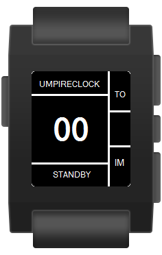
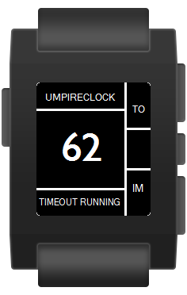
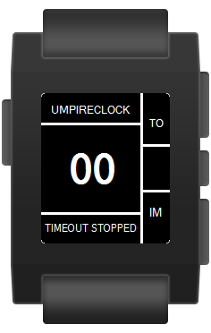
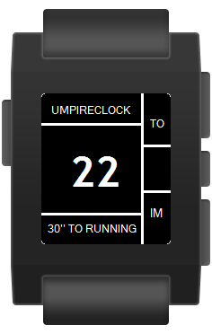
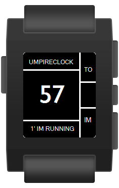

# UmpireClock
by Michael Krenn, American Football official in Austria.

Clock for American Football Umpires working as on-field timekeeper based on the NCAA Rules 2016.

With this watchapp it is possible to measure the timeouts (even a 30-second timeout) and 1-minute intermission after scores and between the quarters of each half without taking a look at the watch and missing action. It works offline although most of the settings like notifications and vibration patterns are customizable via phone when connected.

Pressing the up-button starts the 65-second countdown, measuring the interval from the beginning of the timeout to the ball has to be declared ready for play (the remaining 25 seconds are job of the playclock operator), giving a vibration signal as confirmation.
Pressing the up-button long works in the same manner except the countdown starts at 35 seconds to measure a 30-second timeout.
Pressing the down-button starts the 60-second countdown, measuring the 1-minute intermission from the ball is declared dead after a score or at the the end of the 1st/3rd quarter to the ball has to be declared ready for play, giving a vibration signal as confirmation. 
3 notifications can be configured individually. Per default the umpireclock sends a vibration signal when 10 seconds left (notify teams) and, of course, when the timer expires.

## How it works
The back-button (the one on the left side) always closes the UmpireClock watchapp, so be careful not pressing it accidentally!

The 3 buttons on the right side always works as follows unless noted at the different state descriptions:

#### UP-Button (*1x short vibe*)
Starts 65" timeout countdown (new state: *TIMEOUT RUNNING*)
#### UP-Button pressed long (*2x short vibes*)
Starts 35" timeout countdown (new state: *30" TO RUNNING*)
#### SELECT-Button
Disabled - no action
#### SELECT-Button pressed long
Set UmpireClock back to standby (new state: *STANDBY*)
#### DOWN-Button (*1x short vibe*)
Starts 1' intermission countdown (new state: *1' IM RUNNING*)
#### DOWN-Button pressed long
Disabled - no action

The timer can have the following states:

### STANDBY (start screen)

#### SELECT-Button
Vibration signals can be enabled / disabled immediately without connecting to the phone.

### TIMEOUT RUNNING

#### SELECT-Button pressed long
Stops 65" timeout countdown (new state: *TO STOPPED*)

### TIMEOUT EXPIRED (*1x long vibe*)

### TIMEOUT STOPPED

### 30" TO RUNNING / 30" TO EXPIRED / 30" TO STOPPED
The 35 second countdown works the same way as described for the 65 second countdown.

### 1' IM RUNNING / 1' IM EXPIRED / 1' IM STOPPED
The 60 second countdown works the same way as described for the 65 second countdown.

## Notifications
At least up to 3 notifications can be configured via smartphone. The following notification is set by default:

### BALL READY? (*1x short vibe*)
When the timer reads *10*, the state message changes from *TIMEOUT RUNNING*, *30" TO RUNNING" or *1' IM RUNNING* to *10" TILLL READY!* and a notification (one short vibration) is sent.

## Settings
On the smartphone the vibration patterns, notifications and other features of the UmpireClock can be configured very easily. Note that there is only communication from the smartphone to the Pebble watch implemented, not the other way! So enabling / disabling the vibration on the Pebble (SELECT-Button pressed in standby mode) is overwritten when the settings on the smartphone are saved the next time (while connected to the Pebble watch, of course).
