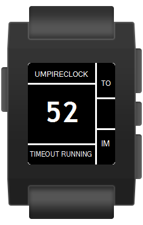

# UmpireClock
by Michael Krenn, American Football official in Austria.

Clock for American Football Umpires working as on-field timekeeper based on the NCAA Rules 2016.

With this watchapp it is possible to measure the timeouts (even a 30-second timeout) and 1-minute intermission after scores and between the quarters of each half without taking a look at the watch and missing action. It works offline although most of the settings like notifications and vibration patterns are customizable via phone when connected.

Pressing the up-button starts the 65-second countdown, measuring the interval from the beginning of the timeout to the ball has to be declared ready for play (the remaining 25 seconds are job of the playclock operator), giving a vibration signal as confirmation.  
Pressing the up-button long works in the same manner except the countdown starts at 35 seconds to measure a 30-second timeout.  
Pressing the down-button starts the 60-second countdown, measuring the 1-minute intermission from the ball is declared dead after a score or at the the end of the 1st/3rd quarter to the ball has to be declared ready for play, giving a vibration signal as confirmation.   
3 notifications can be configured individually. Per default the UmpireClock sends a vibration signal when 10 seconds left (notify teams) and, of course, when the timer expires.

## How it works
The back-button (the one on the left side) always closes the UmpireClock watchapp, so be careful not pressing it accidentally!

The 3 buttons on the right side always works as follows unless noted at the different state descriptions:

#### UP-Button (*1x short vibe*)
Starts 65" timeout countdown (new state: *TIMEOUT RUNNING*)
#### UP-Button pressed long (*2x short vibes*)
Starts 35" timeout countdown (new state: *30" TO RUNNING*)
#### SELECT-Button
Disabled - no action
#### SELECT-Button pressed long
Set UmpireClock back to standby (new state: *STANDBY*)
#### DOWN-Button (*1x short vibe*)
Starts 1' intermission countdown (new state: *1' IM RUNNING*)
#### DOWN-Button pressed long
Disabled - no action

The timer can have the following states:

### STANDBY (start screen)

#### SELECT-Button
Vibration signals can be enabled / disabled immediately without connecting to the phone.

### TIMEOUT RUNNING

#### SELECT-Button pressed long
Stops 65" timeout countdown (new state: *TO STOPPED*)

### TIMEOUT EXPIRED (*1x long vibe*)

### TIMEOUT STOPPED

### 30" TO RUNNING / 30" TO EXPIRED / 30" TO STOPPED
The 35 second countdown works the same way as described for the 65 second countdown.

### 1' IM RUNNING / 1' IM EXPIRED / 1' IM STOPPED
The 60 second countdown works the same way as described for the 65 second countdown.

## Notifications
At least up to 3 notifications can be configured via smartphone. The following notification is set by default:

### 10 TILL READY! (*2x short vibes*)
When the timer reads *10*, the state message changes from *TIMEOUT RUNNING*, *30" TO RUNNING" or *1' IM RUNNING* to *10" TILLL READY!* and a notification (one short vibration) is sent.

## Settings
On the smartphone the vibration patterns, notifications and other features of the UmpireClock can be configured very easily. Note that there is only communication from the smartphone to the Pebble watch implemented, not the other way! So enabling / disabling the vibration on the Pebble (SELECT-Button pressed in standby mode) is overwritten when the settings on the smartphone are saved the next time (while connected to the Pebble watch, of course).

***

# UmpireClock
von Michael Krenn, American Football Schiedsrichter in Österreich.

Uhr für American Football Schiedsrichter, die am Feld als Umpire für die Zeitnehmung verantwortlich sind, basierend auf den NCAA Rules 2016.

Mit dieser Watchapp ist es möglich, Timeouts (auch 30-Sekunden-Timeouts) und 1-Minuten-Unterbrechungen nach Scores und zwischen den Vierteln jeder Halbzeit zu stoppen, ohne zu oft auf die Uhr zu sehen und Vorgänge am Spielfeld zu verpassen. Die Uhr funktioniert ohne Verbindung zum Handy, trotzdem die meisten Einstellungen wie Benachrichtigungen und Vibrationsmuster via Handy veränderbar sind, wenn eine Verbindung besteht.

Den oberen Knopf zu drücken statet den 65-Sekunden Countdown, um das Intervall vom Beginn des Timeouts bis zur Ballfreigabe zu messen (die übrigen 25 Sekunden sind Aufgabe des PlayClock-Verantwortlichen), was mit einem Vibrationssignal bestätigt wird.
Den oberen Knopf länger zu drücken führt zu dem selben Ergebnis, allerdings startet der Countdown bei 35 Sekunden, um ein 30-Sekunden-Timeout zu messen.
Das Drücken des unteren Knopfes startet einen 60-Sekunden Countdown, um die 1-Minuten-Unterbrechung vom Zeitpunkt, zu dem der Ball nach einem Score oder am Ende des 1./3. Viertels tot wurde, bis der Ball wieder freizugeben ist, zu messen, was mit einem Vibrationssignal bestätigt wird.

3 Benachrichtigungen können individuell eingestellt werden. Standardmäßig sendet die UmpireClock ein Vibrationssignal wenn 10 Sekunden verbleiben (Teams benachrichtigen) und natürlich wenn der Countdown abgelaufen ist.

## Wie funktionierts?
Der Zurück-Knopf (jener auf der linken Seite) schließt immer die UmpireClock Watchapp, daher ist Vorsicht geboten, ihn nicht unabsichtlich zu drücken.

Die 3 Knöpfe auf der rechten Seite funktionieren immer wie folgt, außer es ist bei den einzelnen Zuständen etwas anderes beschrieben:

#### Knopf oben (*1x kurze Vibration*)
Startet den 65" Timeout Countdown (neuer Zustand: *TIMEOUT RUNNING*)
#### Knopf oben lange gedrückt (*2x kurze Vibrationen*)
Startet den 35" Timeout Countdown (neuer Zustand: *30" TO RUNNING*)
#### Knopf in der Mitte
Deaktiviert - kein Ereignis
#### Knopf in der Mitte lange gedrückt
Setzt die Uhr zurück in den Standby-Modus (neuer Zustand: *STANDBY*)
#### DOWN-Button (*1x short vibe*)
Startet 1'-Unterbrechung Countdown (neuer Status: *1' IM RUNNING*)
#### DOWN-Button pressed long
Deaktiviert - kein Ereignis

Die Uhr kann folgende Zustände haben:

### STANDBY (Start-Ansicht)

#### Knopf in der Mitte
Vibrationssignale können sofort ein- / ausgeschaltet werden, ohne mit dem Handy verbunden sein zu müssen.

### TIMEOUT RUNNING

#### Knopf in der Mitte lange gedrückt
Stoppt den 65" Timeout Countdown (neuer Status: *TO STOPPED*)

### TIMEOUT EXPIRED (*1x lange Vibration*)

### TIMEOUT STOPPED

### 30" TO RUNNING / 30" TO EXPIRED / 30" TO STOPPED
Der 35-Sekunden Countdown funktioniert gleichermaßen wie für den 65-Sekunden Countdown beschrieben.

### 1' IM RUNNING / 1' IM EXPIRED / 1' IM STOPPED
Der 60-Sekunden Countdown funktioniert gleichermaßen wie für den 65-Sekunden Countdown beschrieben.

## Benachrichtigungen
Bis zu 3 Benachrichtigungen können am Handy konfiguriert werden. Die folgende Benachrichtigung ist standardmäßig gesetzt:

### 10 TILL READY! (*2x kurze Vibrationen*)
Sobald die Uhr *10* anzeigt, ändert sich die Nachricht von *TIMEOUT RUNNING*, *30" TO RUNNING"* oder *1' IM RUNNING* auf *10" TILLL READY!* und eine Benachrichtigung (eine kurze Vibration) wird gesendet.

## Settings
Am Handy können die Vibrationsmuster, Benachrichtigungen und andere Funktionen der PlayClock sehr einfach konfiguriert werden. Beachten Sie, dass nur Kommunikation vom Handy zur Pebble-Uhr eingerichtet ist, nicht anders herum! Somit wird die Aktivierung / Deaktivierung der Vibration (Knopf in der Mitte wird im Standby-Modus gedrückt) auf der Pebble überschrieben, sobald die Einstellungen am Handy das nächste mal gespeichert werden.

